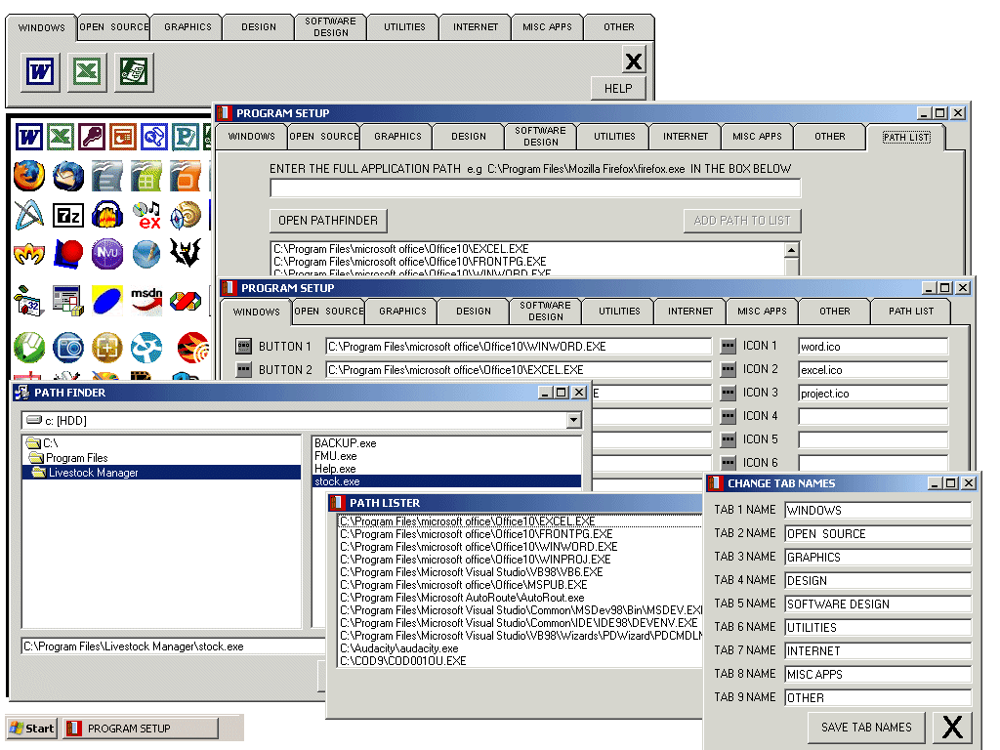



## Desktop Organiser v1\.5\.1350

### Description

Title: Desktop Organiser v1.5.1350

Update1: missing icons put in

Update: the missing frmPathfinder put in.

The Desktop Oganiser - unclutter that crowded computer screen.

The organiser is fully customisable , Tabs, Icons and Program locations being user chosen.  Capable of launching upto 108 programs from 9 Tabs and being changed any time you the user chooses.

nice simple app, works quite nicely too! if you like it please vote for it

This code is free to use change it, bend it, do what u will with it just give credit where credit is due
 
### More Info
 
see code

             |
---                |---
**Submitted On**   |2007-03-30 11:01:18
**By**             |[caver dave](https://github.com/Planet-Source-Code/PSCIndex/blob/master/ByAuthor/caver-dave.md)
**Level**          |Beginner
**User Rating**    |4.7 (28 globes from 6 users)
**Compatibility**  |VB 6\.0
**Category**       |[Complete Applications](https://github.com/Planet-Source-Code/PSCIndex/blob/master/ByCategory/complete-applications__1-27.md)
**World**          |[Visual Basic](https://github.com/Planet-Source-Code/PSCIndex/blob/master/ByWorld/visual-basic.md)
**Archive File**   |[Desktop\_Or205759412007\.zip](https://github.com/Planet-Source-Code/caver-dave-desktop-organiser-v1-5-1350__1-68234/archive/master.zip)

### API Declarations

see code

